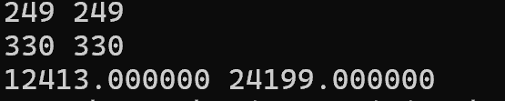

# BMI (Belajar Matematika Isekai)

## Table of Content
* [Feature](#feature)
* [Total Poin](#total-poin)
* [Write Up](#write-up)
* [Hasil Output](#hasil-output)
## Feature
1. Spek Wajib Output (2 Poin)
2. Spek Bonus Recreate C Program (1 Poin)

## Total Poin
Total Poin = 2 + 1  = 3 Poin
## Write Up
1.  Kode ini dapat di terjemahkan sebagai berikut  
### Bedah

    .cpu arm7tdmi
    -> Mengatur arsitektur CPU yang digunakan, dalam hal ini ARM7TDMI.

    .arch armv4t
    -> Menetapkan arsitektur target sebagai ARMv4T, yang merupakan versi dari arsitektur ARM.

    .fpu softvfp

    .eabi_attribute 20, 1
    .eabi_attribute 21, 1
    .eabi_attribute 23, 3
    .eabi_attribute 24, 1
    .eabi_attribute 25, 1
    .eabi_attribute 26, 1
    .eabi_attribute 30, 6
    .eabi_attribute 34, 0
    .eabi_attribute 18, 4

    .file "program.c"
    -> Menyatakan nama file sumber yang terkait dengan kode ini, dalam hal ini "program.c".

    .text
    -> Menunjukkan bahwa bagian ini adalah kode executable, bukan data.

    .section .rodata
    -> Memulai bagian data yang hanya dibaca (read-only data), biasanya untuk string konstan.

    .align 2
    -> Menyelaraskan alamat ke batas 4-byte untuk efisiensi akses.

    .LC0:
        .ascii "%d %d\012\000"
    -> Menyimpan string format untuk output, dalam hal ini format untuk dua integer dengan newline.

    .text
    -> Memulai kembali bagian kode executable.

    .align 2
    -> Menyelaraskan lagi untuk bagian baru.

    .global compute
    -> Menetapkan label "compute" sebagai simbol global sehingga dapat diakses dari luar modul ini.

    .syntax unified
    -> Menggunakan sintaksis unifikasi untuk kode assembler, yang mendukung instruksi ARM dan Thumb.

    .arm
    -> Menunjukkan bahwa instruksi yang diikuti adalah untuk arsitektur ARM.

    .type compute, %function
    -> Menetapkan jenis simbol "compute" sebagai fungsi.

    compute:
    -> Label untuk memulai fungsi "compute".

        @ Function supports interworking.
    -> Komentar yang menunjukkan bahwa fungsi ini mendukung interworking antara ARM dan Thumb.

        @ args = 0, pretend = 0, frame = 40
        @ frame_needed = 1, uses_anonymous_args = 0
    -> Komentar yang memberikan informasi tentang argumen dan penggunaan frame.

        push {fp, lr}
    -> Menyimpan frame pointer (fp) dan link register (lr) ke stack.

        add fp, sp, #4
    -> Mengatur frame pointer untuk menunjuk ke stack yang baru.

        sub sp, sp, #40
    -> Mengurangi ukuran stack sebanyak 40 byte untuk alokasi lokal.

        str r0, [fp, #-40]
    -> Menyimpan nilai argumen pertama (r0) ke lokasi di stack.

        str r1, [fp, #-44]
    -> Menyimpan nilai argumen kedua (r1) ke lokasi di stack.

        ldr r3, [fp, #-40]
    -> Memuat nilai argumen pertama ke register r3.

        lsl r3, r3, #3
    -> Menggeser nilai di r3 ke kiri sebanyak 3 bit (mengalikan dengan 8).

        add r3, r3, #25
    -> Menambahkan 25 ke nilai di r3.

        lsr r2, r3, #31
    -> Menggeser nilai di r3 ke kanan sebanyak 31 bit untuk mendapatkan bit paling signifikan.

        add r3, r2, r3
    -> Menambahkan bit yang diperoleh ke r3.

        asr r3, r3, #1
    -> Menggeser r3 ke kanan dengan sign, membagi nilainya dengan 2.

        str r3, [fp, #-8]
    -> Menyimpan hasil ke lokasi di stack.

        ldr r3, [fp, #-44]
    -> Memuat nilai argumen kedua ke r3.

        ldr r2, [fp, #-8]
    -> Memuat hasil sebelumnya ke r2.

        mul r3, r2, r3
    -> Mengalikan argumen kedua dengan hasil yang disimpan.

        str r3, [fp, #-12]
    -> Menyimpan hasil perkalian ke stack.

        ldr r2, [fp, #-44]
    -> Memuat nilai argumen kedua lagi.

        ldr r3, [fp, #-8]
    -> Memuat hasil yang disimpan sebelumnya ke r3.

        add r3, r2, r3
    -> Menjumlahkan argumen kedua dengan hasil.

        str r3, [fp, #-16]
    -> Menyimpan hasil penjumlahan ke stack.

        ldr r3, [fp, #-12]
    -> Memuat hasil perkalian ke r3.

        and r3, r3, #3
    -> Melakukan operasi AND dengan 3 untuk mendapatkan 2 bit terkecil.

        ldr r2, [fp, #-16]
    -> Memuat hasil penjumlahan ke r2.

        lsl r3, r2, r3
    -> Menggeser hasil penjumlahan berdasarkan nilai r3.

        str r3, [fp, #-20]
    -> Menyimpan hasil ke stack.

        ldr r2, [fp, #-20]
    -> Memuat hasil dari langkah sebelumnya ke r2.

        ldr r3, [fp, #-16]
    -> Memuat hasil penjumlahan ke r3.

        orr r3, r2, r3
    -> Melakukan operasi OR untuk menggabungkan dua hasil.

        ldr r2, [fp, #-12]
    -> Memuat hasil perkalian ke r2.

        eor r3, r3, r2
    -> Melakukan operasi XOR antara hasil OR dan hasil perkalian.

        str r3, [fp, #-24]
    -> Menyimpan hasil XOR ke stack.

        ldr r2, [fp, #-20]
    -> Memuat hasil dari langkah sebelumnya ke r2.

        ldr r1, [fp, #-16]
    -> Memuat hasil penjumlahan ke r1.

        ldr r0, .L3
    -> Memuat alamat dari label .L3 ke r0.

        bl printf
    -> Memanggil fungsi printf untuk mencetak hasil ke layar.

        str r0, [fp, #-28]
    -> Menyimpan hasil dari printf ke stack.

        ldr r2, [fp, #-28]
    -> Memuat hasil dari printf ke r2.

        ldr r1, [fp, #-24]
    -> Memuat hasil XOR ke r1.

        ldr r0, .L3
    -> Memuat alamat dari label .L3 lagi ke r0.

        bl printf
    -> Memanggil printf untuk mencetak hasil XOR ke layar.

        str r0, [fp, #-32]
    -> Menyimpan hasil dari printf ke stack.

        ldr r3, [fp, #-28]
    -> Memuat hasil dari printf ke r3.

        ldr r2, [fp, #-32]
    -> Memuat hasil dari printf ke r2.

        mul r3, r2, r3
    -> Mengalikan hasil dari dua printf.

        mov r0, r3
    -> Menetapkan hasil ke r0 untuk mengembalikannya dari fungsi.

        sub sp, fp, #4
    -> Menyusun kembali stack untuk menghapus alokasi lokal.

        @ sp needed
        pop {fp, lr}
    -> Mengambil kembali fp dan lr dari stack.

        bx lr
    -> Kembali dari fungsi ke caller.

    .L4:
        .align 2
    .L3:
        .word .LC0
    -> Label untuk string format, menyimpan alamat dari LC0.

        .size compute, .-compute
    -> Menentukan ukuran fungsi "compute".

        .section .rodata
    -> Memulai kembali bagian data read-only.

        .align 2
    .LC1:
        .ascii "%f %f\012\000"
    -> Menyimpan string format untuk output float dengan newline.

        .text
    -> Memulai kembali bagian kode executable.

        .align 2
    .global main
    -> Menetapkan label "main" sebagai simbol global, sehingga dapat diakses sebagai titik masuk program.

        .syntax unified
    -> Menggunakan sintaksis unifikasi untuk kode assembler.

        .arm
    -> Menunjukkan bahwa instruksi yang diikuti adalah untuk arsitektur ARM.

        .type main, %function
    -> Menetapkan jenis simbol "main" sebagai fungsi.

    main:
    -> Label untuk memulai fungsi "main".

        @ Function supports interworking.
    -> Komentar yang menunjukkan bahwa fungsi ini mendukung interworking.

        @ args = 0, pretend = 0, frame = 8
        @ frame_needed = 1, uses_anonymous_args = 0
    -> Komentar yang memberikan informasi tentang argumen dan penggunaan frame.

        push {r4, r5, fp, lr}
    -> Menyimpan register yang digunakan ke stack.

        add fp, sp, #12
    -> Mengatur frame pointer untuk menunjuk ke stack yang baru.

        sub sp, sp, #16
    -> Mengurangi ukuran stack sebanyak 16 byte untuk alokasi lokal.

        mov r1, #42
    -> Memuat nilai 42 ke register r1.

        mov r0, #69
    -> Memuat nilai 69 ke register r0.

        bl compute
    -> Memanggil fungsi "compute".

        mov r3, r0
    -> Menyimpan hasil dari fungsi compute ke r3.

        mov r0, r3
    -> Memindahkan hasil ke r0 untuk konversi ke float.

        bl __aeabi_i2f
    -> Mengonversi integer ke float.

        mov r3, r0
    -> Menyimpan hasil konversi ke r3.

        ldr r0, .L5
    -> Memuat alamat dari label .L5 ke r0.

        bl printf
    -> Memanggil fungsi printf untuk mencetak hasil ke layar.

        mov r0, #0
    -> Mengembalikan nilai 0 sebagai status keluar dari fungsi.

        sub sp, fp, #4
    -> Mengatur kembali stack untuk menghapus alokasi lokal.

        pop {r4, fp, lr}
    -> Mengambil kembali register dari stack.

        bx lr
    -> Kembali dari fungsi ke caller.

    .L5:
        .align 2
        .word .LC1
    -> Label untuk string format, menyimpan alamat dari LC1.

        .size main, .-main
    -> Menentukan ukuran fungsi "main".

2. Pahami hasil nya

Kurang lebih kode ini berisi hal seperti berikut:

-  Program bernama "program.c"
- Terdapat fungsi compute yang memiliki parameter 2 buah dan fungsi yang return integer.   Di dalam fungsi terdapat banyak operasi shift dan aritmetik.
- Di dalam nya, hasil nya akan diprint sebelum direturn dengan format "%d %d\012\000" di dalam soal atau "%d %d\n" di kode C
- Terdapat fungsi main yang akan menjalankan fungsi compute dua kali dan print dengan format "%f %f\n" sama seperti di atas, bedanya ia sebagai float.
3. Recreate Program

    Program dibuat kembali menggunakan bahasa C dan masukkan input yang benar seperti pada file program.c

4. Jalankan program
    
    gcc -o program program.c 
    ./program

5. Hasilnya kurang lebih seperti ini
 

## Hasil Output
