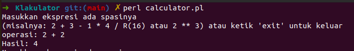
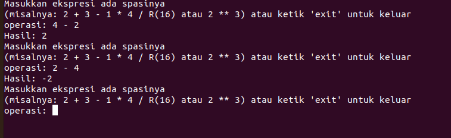
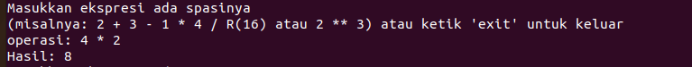
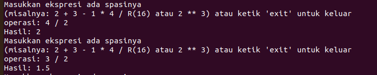
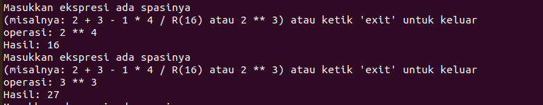
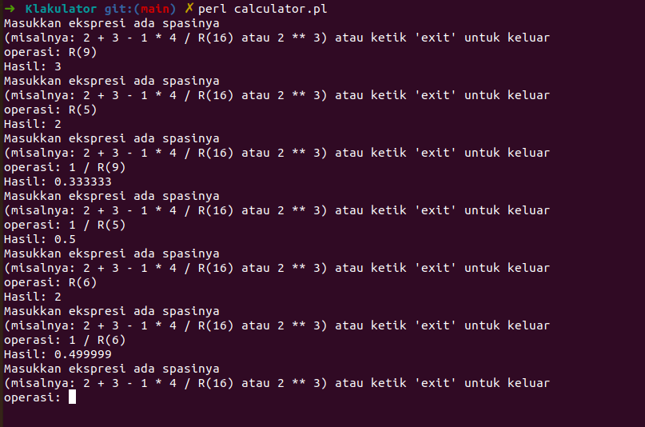

# Klakulator

## Table of Content
* [Ketentuan](#ketentuan)
* [Feature](#feature)
* [Total Poin](#total-poin)
* [Usage](#usage)
* [Test](#test)
* [Profile](#profile)
## Ketentuan
Buatlah sebuah program kalkulator sederhana menggunakan bahasa Perl, yang setidaknya dapat melakukan operasi: 
- Penjumlahan
- Pengurangan
- Perkalian
- Pembagian

Kalkulator akan menghitung hasil dari ekspresi yang dimasukkan oleh pengguna. Ekspresi terdiri atas operator (+, -, *, /) dan operand (integer). Tidak ada order of operations, seluruh operasi dievaluasi dari kiri ke kanan. 

Kalkulator harus dibuat tanpa menggunakan:
- Operator +, -, *, /, %, **, dan seluruh variasi assignmentnya;
- Control flow berbasis looping (kecuali untuk input);
- Rekursi

Sebagai gantinya, silahkan gunakan operator bitwise serta goto. Setiap penggunaan operator terlarang, rekursi, maupun control flow akan mengurangi nilai sebesar (0.5 poin). Diperbolehkan menggunakan library I/O jika diperlukan.

## Feature
1. Spek Wajib (3 Poin)
2. Spek Bonus Pangkat (1 Poin)
3. Spek Bonus Aproksimasi Akar (2 Poin)

## Total Poin
Total Poin = 3 + 1 + 2 = 6 Poin

## Usage
    {make sure to have installed perl}  

    Perl calculator.pl

## Test
1. Tambah
 

 
2. Kurang
 

 
3. Kali
 

 
4. Bagi
 

 
5. Pangkat
 

 
6. Akar
 

 

## Profile
* Nama: Albert Ghazaly
* NIM: 13522150
* Kelas: K03