# SisterJS

## Table of Contents
* [Ketentuan](#ketentuan)
* [Features](#Features)
* [Total Poin](#total-poin)
* [Screenshots](#screenshots)
* [Setup](#setup)
* [Usage](#usage)
* [Pengujian](#pengujian)
* [Profile](#profile)
## Ketentuan

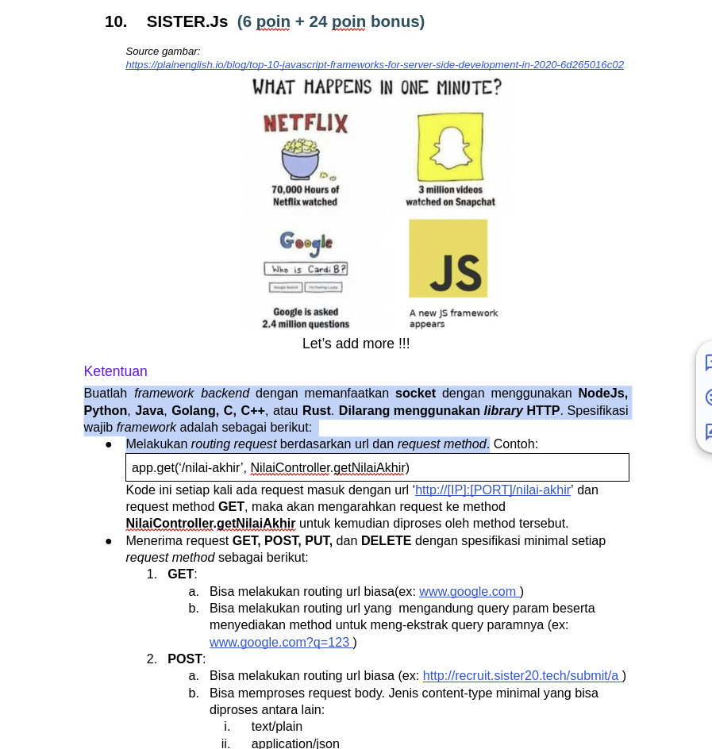 
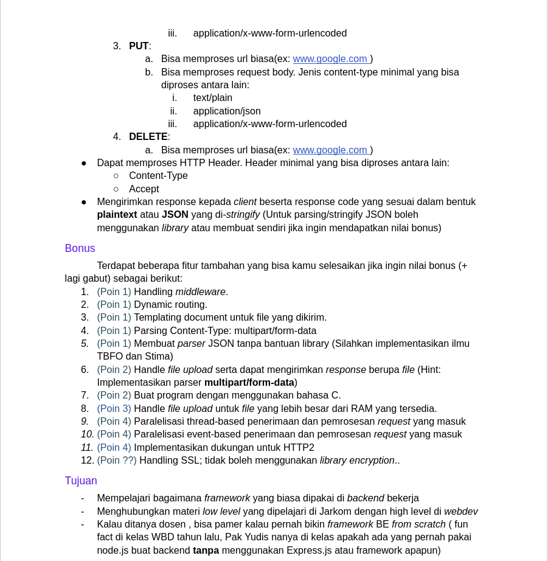 

## Features
- Spek Wajib (6 Poin)
- Bonus Parser Json manual (1 Poin)
- Bonus Buat program dengan bahas C (2 poin)
- Bonus Paralelisasi thread-based (4 poin)
- Bonus Paralelisasi event-based (4 poin)
- Bonus HTTP2 (4 poin)

## Total Poin
    point = 6 + 1 + 2 + 4 + 4 + 4 = 21 Poin

## Usage
    Untuk server: 

    cd src
        gcc -o server server.c -lpthread

        - untuk thread-based:
            ./server thread

        - untuk event-based:
            ./server event
    
    Untuk test:
        cd src
        gcc -o test test.c -lcurl 
        ./test

## Pengujian
1. GET
- no query: 
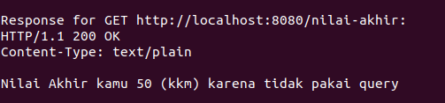
 
Note: Ambil data adalah fungsi untuk get hash table data dari server, nilai awal kosong
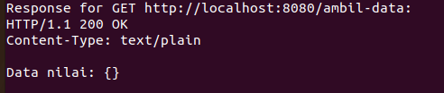
- with query: 
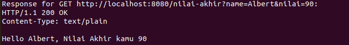
 
2. POST
- plain text 
Request 
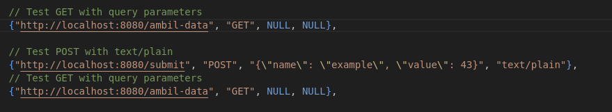 
Response 
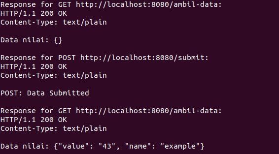 
- Json  
Request 
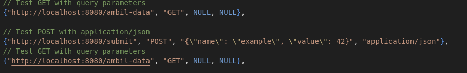 
Response 
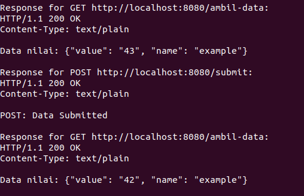 
- Urlencoded  
Request 
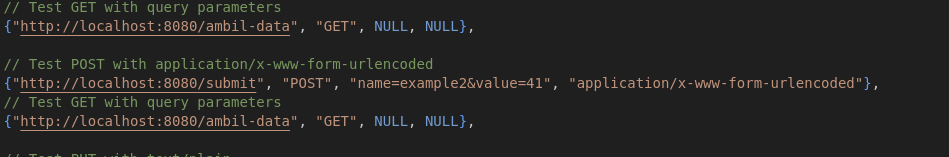 
Response 
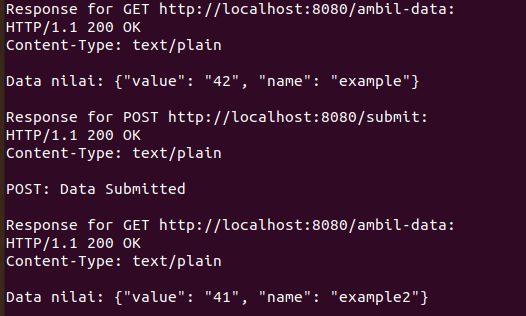 
 
3. PUT
- plain text 
Request 
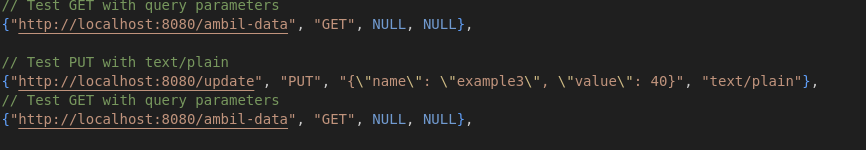 
Response 
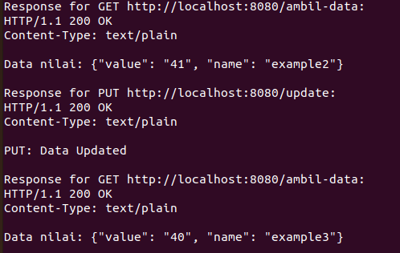 
- Json  
Request 
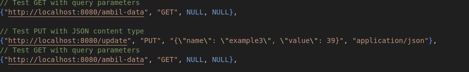 
Response 
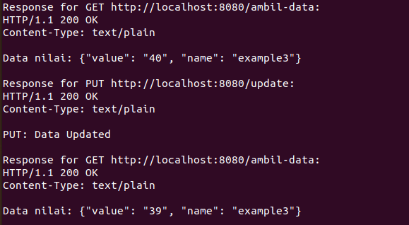 
- Urlencoded  
Request 
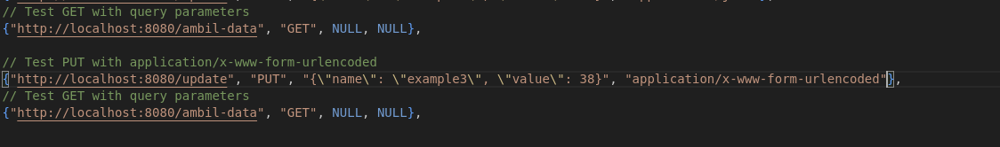 
Response 
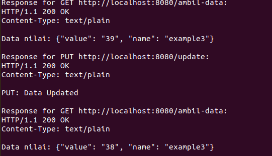 
4. Delete
Request 
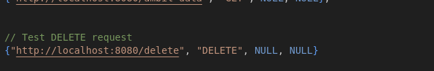 
Response 
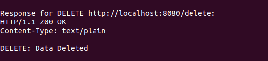 
5. HTTP2
Request 
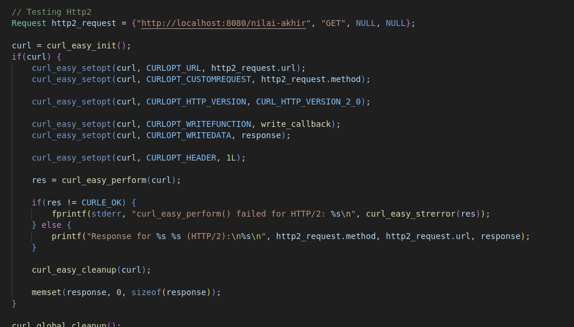 
Response 
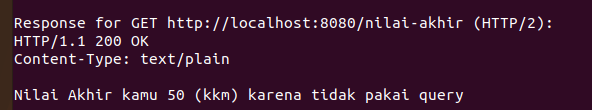 

## Profile
* Nama: Albert Ghazaly
* NIM: 13522150
* Kelas: K03
