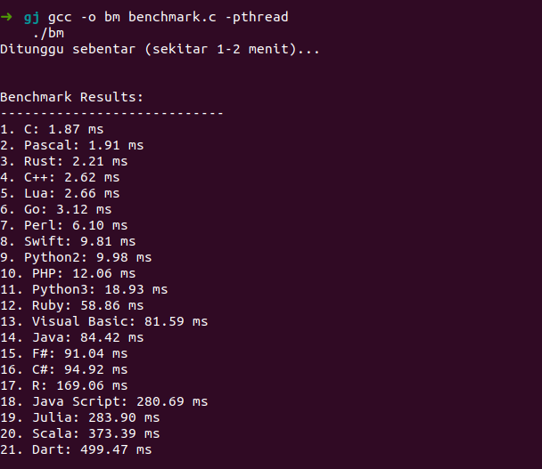

# Benchmark

## Table of Contents
* [Ketentuan](#ketentuan)
* [Features](#Features)
* [Total Poin](#total-poin)
* [Screenshots](#screenshots)
* [Setup](#setup)
* [Usage](#usage)
* [ListBahasa](#list-bahasa)
* [Profile](#profile)
* [Note](#note)
## Ketentuan
Buatlah program yang menerima input berupa matrix nn yang dibaca dari sebuah file dan mengeluarkan output berupa hasil inversi dari matrix input yang ditulis pada sebuah file yang berbeda. Format file input berupa sebuah bilangan n pada baris pertama, diikuti n buah baris yang masing-masing memiliki n buah bilangan. Program tidak perlu menghandle kondisi dimana matrix input yang diberikan tidak dapat diinversi dan asumsikan input selalu berupa matrix nn. Algoritma inversi yang digunakan adalah Gauss-Jordan. Dilarang menggunakan library.

Program di atas kemudian diimplementasikan dalam minimal 10 jumlah bahasa pemrograman yang berbeda (dilarang menggunakan esoteric language).  Kemudian, buatlah sebuah program benchmarking yang menggunakan bahasa pemrograman C untuk mengecek kecepatan masing-masing program. Program ini akan otomatis menjalankan semua program invers matrix masing-masing sejumlah 5 kali dan akan menunjukkan waktu rata-rata yang dibutuhkan untuk menyelesaikan kalkulasi pada akhir program. 

Bonus

- (Poin 1.5) Implementasikan program dengan menggunakan algoritma Strassen.
- (Poin 2.5) Implementasikan multicore programming pada program benchmarking yang akan menjalankan m buah program inversi secara bersamaan; dimana m merupakan jumlah core CPU yang dimiliki.
- (Poin 2.5) Implementasikan dalam minimal 15 bahasa pemrograman berbeda.
- (Poin 2.5) Implementasikan dalam minimal 20 bahasa pemrograman berbeda.
- (Poin 5) Implementasikan dalam minimal 30 bahasa pemrograman berbeda.

## Features
- Spek Wajib (6 Poin)
- Bonus multicore programming (2.5 Poin)
- 15 bahasa (2.5 poin)
- 20 bahasa (2.5 poin)
## Total Poin
    point = 6 + 2.5 + 2.5 + 2.5 = 13.5 Poin

## Screenshots

## Setup
install all programming language below : )

## Usage
    gcc -o bm benchmark.c -pthread
    ./bm

## List bahasa:

1. C

    gcc -o bin/c src/inverse.c
    ./bin/c
    
2. C++

    g++ -o bin/cpp src/inverse.cpp

    ./bin/cpp

3.  Csharp

    dotnet run --project src/csharp 

    or

    dotnet src/csharp/bin/Debug/net8.0/csharp.dll

4. Pascal

    fpc -obin/pascal/inverse src/inverse.pas

    ./bin/pascal/inverse

5. Python3

    python3 src/inverse.py3

6. Python2

    python2 src/inverse.py2

7. PHP

    php src/inverse.php

8. Ruby

    ruby src/inverse.rb

9. Lua

    lua src/inverse.lua

10. Perl

    perl src/inverse.pl

11. go

    go build -o src/go_bin/go src/main.go

    ./bin/go

12. Rust

    cd src

    rustc main.rs -o ../bin/rust 

    ./bin/rust

13. Julia

    julia src/inverse.jl

14. Java

    javac src/inverse.java -d bin

    java -cp bin inverse

15. R

    Rscript src/inverse.R

16. Swift

    swiftc -o bin/swift src/inverse.swift

    ./bin/swift

17. Scala

    scalac src/inverse.scala -d bin/scala

    scala -cp bin/scala Inverse

18. Dart

    dart run src/inverse.dart

19. F#

    cd src/fsharp

    dotnet publish -c Release -o ../../bin/
fsharp

    cd ../..

    ./bin/fsharp/fsharp

    or

    dotnet src/fsharp/bin/Release/net8.0/
    fsharp.dll

20. Visual basic

    dotnet run --project src/vbasic

    or

    dotnet src/vbasic/bin/Debug/net8.0/vbasic.dll
21. Java Script

    node src/inverse.js
 
## Profile
* Nama: Albert Ghazaly
* NIM: 13522150
* Kelas: K03

## Note
    pada file input dalam folder input, tambahkan new line di akhir baris agar pada program lua tidak ada warning. (sebenarnya tidak masalah cuma biar tidak ada warning aja) contoh ada pada folder input

