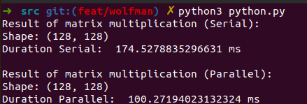
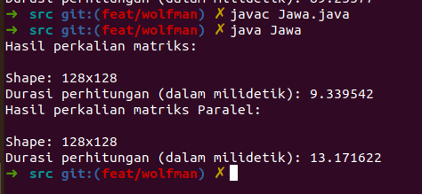
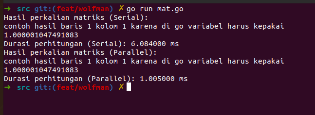
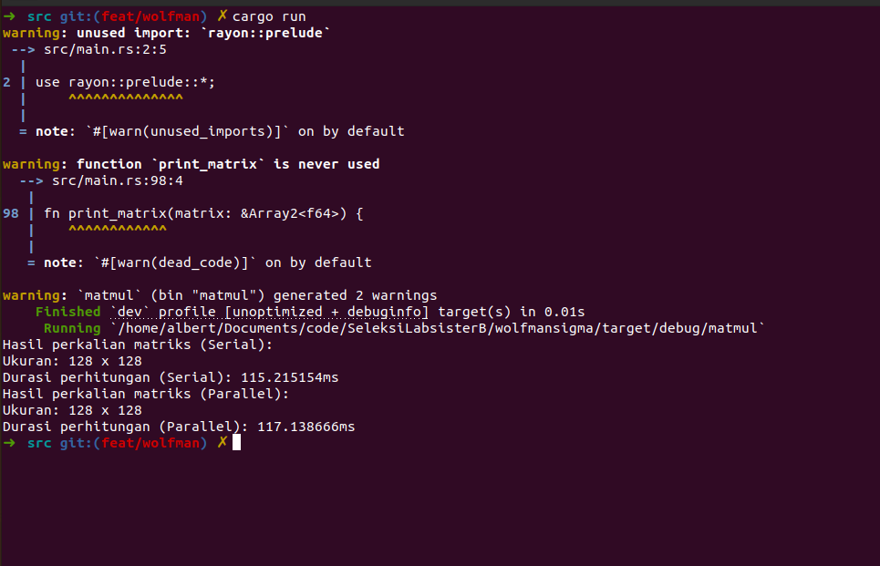
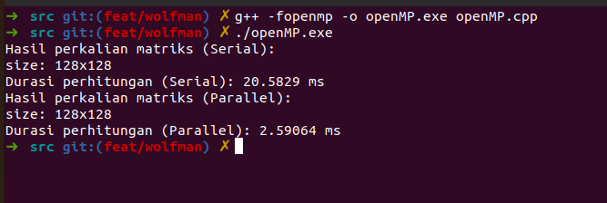
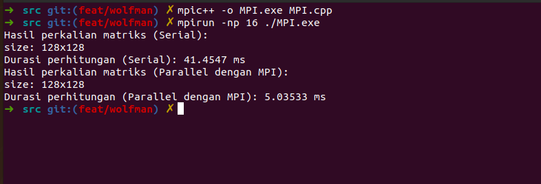
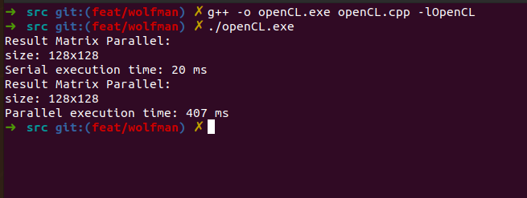
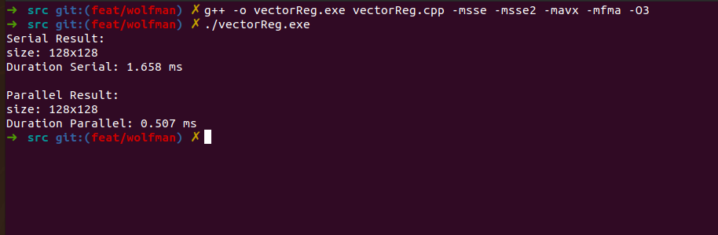
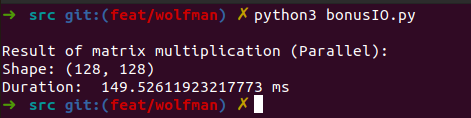
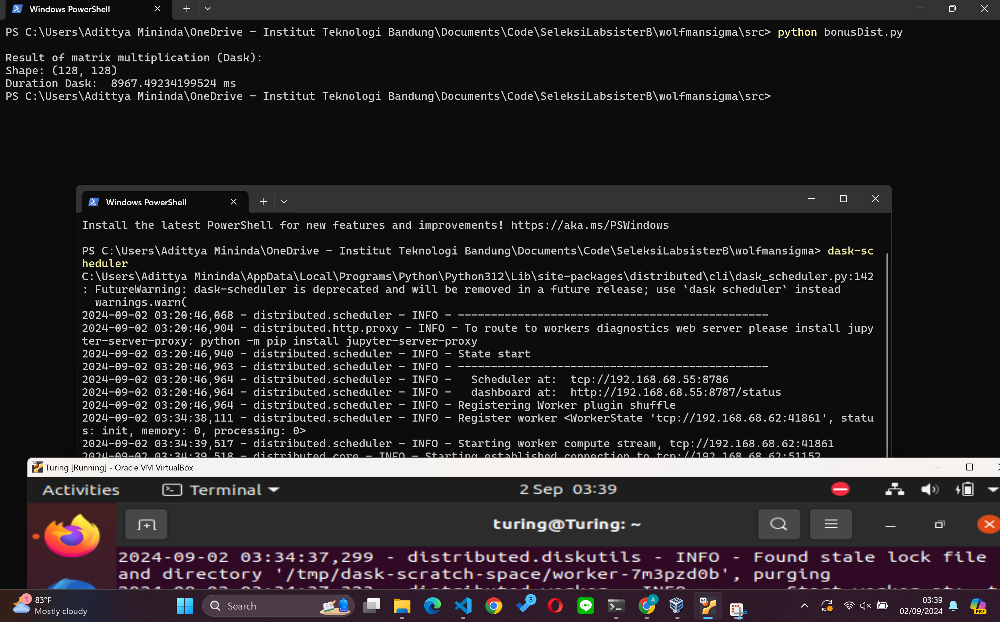

# Wolfman|Sigma

## Table of Contents
* [Ketentuan](#ketentuan)
* [Features](#Features)
* [Total Poin](#total-poin)
* [Penjelasan Singkat](#penjelasan-singkat)
* [Usage](#usage)
* [Note](#note)
* [Pengujian](#pengujian)
* [Profile](#profile)
## Ketentuan
- Buatlah sebuah program perhitungan perkalian matriks, kemudian tulis ulang program menggunakan API parallel programming sebanyak mungkin sehingga dapat melakukan paralelisasi 
- Program dapat membaca nama file kasus pengujian melalui argumen. Setelah menerima nama file, program membaca isi elemen matriks yang tersimpan dalam file, kemudian melakukan perhitungan.
- Lakukan pengujian performa program serial dan program paralel menggunakan kasus uji berikut.

Nilai yang diberikan akan berbeda berdasarkan API yang dipilih, dengan angka sebagai berikut:
- (0.5 poin) Python
- (0.5 poin) Java
- (0.5 poin) Go
- (0.5 poin) Rust
- (1 poin) OpenMP
- (2 poin) MPI
- (2 poin) CUDA
- (2 poin) OpenCL
- (3 poin) Vector Register (xmmintrin.h,  emmintrin.h,  immintrin.h)
- (?? poin) Buat API Multiprosessing di tubes OS kalian

Bonus
- (Poin 3) Implementasi di distributed system. Maksudnya lakukan di beberapa device atau beberapa VM yang terpisah secara fisik dan terhubung melalui jaringan. Implementasi pada salah satu API paralel yang Anda pilih.
- (Poin 1) Pipeline I/O untuk melakukan perkalian matriks bersamaan dengan proses pembacaan input. Implementasi pada salah satu API paralel yang Anda pilih.

## Features
- Spek Wajib kecuali CUDA (10 Poin)
- Bonus Distributed System (3 Poin)
- Bonus Pipeline I/O (1 Poin)
## Total Poin
    point = 10 + 3 + 1 = 14 Poin
    
## Penjelasan Singkat
    Berbeda dengan serial yang hanya mengalikan matriks dengan biasa, paralel dapat memangkas waktu atau durasi pada perkalian matriks besasr (lebih dari 64) karena dia banyak  
    core yang digunakan di mana tiap-tiap core menghitung tiap-tiap baris dari hasil perkalian
    
## Usage
    1. Download test case (dari soal) dan taruh di direktori utama:
        | wolfmansigma
            | tcmatmul
            | src
            | img
            | Readme.md

    2. Jalankan program sesuai pengujian (jangan lupa install dask dan dask scheduler untuk bonus Distributed System)

## Note
    Hasil disini adalah hanya berupa dimensi matrix hasil perkalian dan durasi waktu karena terlalu panjang jika harus ditampilkan semua. Untuk ingin tahu hasil perkalian matriks nya, silahkan "uncomment" potongan kode yang menampilkan matriks hasil (ada di main function). Perlu diketahui bahwa program sudah diuji terlebih dahulu dan dipastikan hasilnya sudah sesuai oleh pembuat
## Pengujian
1. Python

    cd src  
    python3 python.py

    Hasil:
    

2. Java

    cd src  
    javac Jawa.java

    java Jawa

    Hasil: 
     
3. Go

    cd src  
    go run mat.go

    Hasil: 
    
3. Rust

    cd src  
    cargo run

    Hasil: 
    
4. openMP

    cd src  
    g++ -fopenmp -o openMP.exe openMP.cpp

    ./openMp.exe

    Hasil: 
    
5. MPI

    cd src  
    mpic++ -o MPI.exe MPI.cpp

    mpirun -np 16 ./MPI.exe

    Note: yang ini angka 16 nya disesuaiin dengan jumlah maks cpu core, kalau tidak error. Kebetulan laptop saya 16.

    Hasil: 
    
6. openMP

    cd src  
    g++ -fopenmp -o openMP.exe openMP.cpp

    ./openMp.exe

    Hasil: 
     
7. openCL

    cd src  
    g++ -o openCL.exe openCL.cpp -lOpenCL

    ./openCL.exe

    Hasil: 
     
8. Vector Register

    cd src  
    g++ -o vectorReg.exe vectorReg.cpp -msse -msse2 -mavx -mfma -O3

    ./vectorReg.exe

    Hasil: 
     

9. bonus I/O

    cd src  
    python3 bonusIO.py

    Hasil: 
     

10. bonus Distribtued System
    1. install dask dan dask scheduler gunakan virtual machine atau mesin lainnya pada semua mesin baik utama maupun virtual
    2. pada komputer utama:
        - terminal 1: 
            dask-scheduler
        catat ip address tcp dask scheduler tcp:://IP:port dan ganti ip pada file bonusDist dengan  
        ip addresss tcp dask yang sekarang
    3. pada komputer VM:
        masukkan ip port yang tadi dicatat pada terminal VM seperti berikut
        terminal:
            dask worker tcp:://IP:port 
    4. pastikan terhubung pada scheduler dengan tanda seperti berikut pada scheduler:

        2024-09-02 03:20:46,964 - distributed.scheduler - INFO - Registering Worker plugin shuffle
        2024-09-02 03:34:38,111 - distributed.scheduler - INFO - Register worker <WorkerState 'tcp://---.---.--.--:41861', status: init, memory: 0, processing: 0>
        2024-09-02 03:34:39,517 - distributed.scheduler - INFO - Starting worker compute stream, tcp://---.---.--.--:41861
        2024-09-02 03:34:39,518 - distributed.core - INFO - Starting established connection to tcp://---.---.--.--:51152

        Note: ---.---.--.-- merupakan ip address dari VM

    5. Setelah terhubung jalankan program pada komputer utama:
        - terminal 2:

            cd src 
            python3 bonusDist.py
        
    Hasil: 
    
    

        

## Profile
* Nama: Albert Ghazaly
* NIM: 13522150
* Kelas: K03
